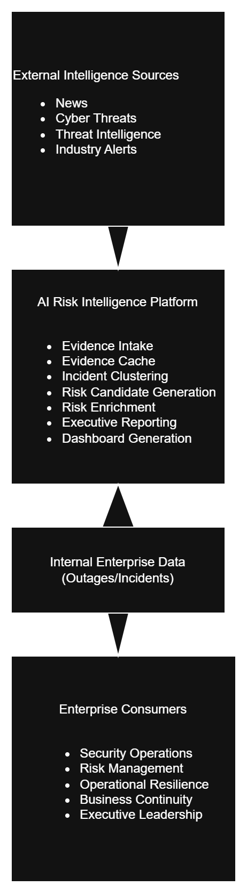
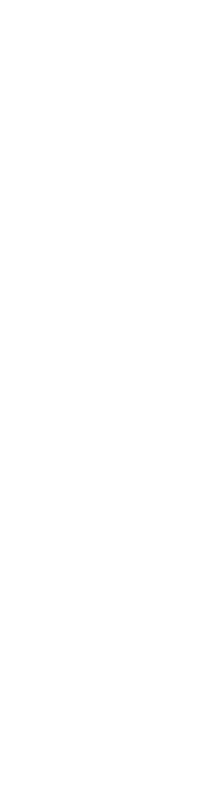
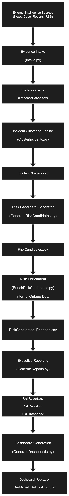
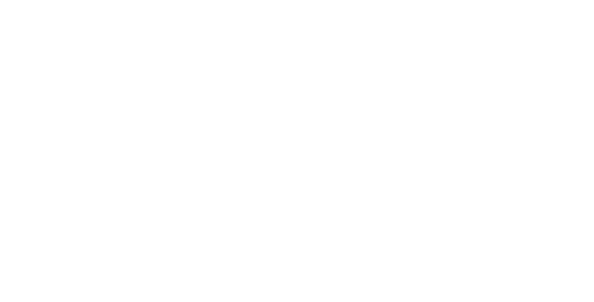

# AI Risk Intelligence Platform

Prototype system that identifies operational, cyber, and technology risks using internet signals and optional internal outage data.

This project demonstrates an AI-assisted risk assessment pipeline designed for operational resilience and enterprise risk monitoring.

## ⚠️ Prototype Status

This project is an early-stage prototype designed to demonstrate how external incident intelligence can be transformed into disaster recovery and operational resilience scenarios.

The scoring and classification models are deterministic and will be enhanced in future iterations.

## Executive Summary

The AI Risk Intelligence Platform is a prototype analytics pipeline designed to identify emerging operational, cyber, and technology risks using external intelligence signals and optional internal outage data.

The system continuously collects incident signals from public sources, groups related evidence into incident clusters, generates structured enterprise risk scenarios, and produces executive-ready reports and dashboard datasets.

The goal of the platform is to demonstrate how AI-assisted workflows can support operational resilience, enterprise risk management, and continuity planning by transforming raw incident data into explainable and actionable risk intelligence.

## Overview

This project is a prototype AI-driven risk intelligence platform designed to identify, cluster, score, enrich, and report on enterprise risks using a combination of external internet signals and optional internal outage data. The system is designed to support risk assessment, operational resilience, continuity planning, and executive reporting.

The platform continuously monitors public information sources for relevant incidents such as technology outages, cyber events, supply chain disruptions, and regulatory issues. Those signals are normalized into incident clusters and then transformed into structured risk candidates. When internal outage data is available, the platform enriches the baseline risk view by adjusting likelihood and impact using internal evidence.

## Platform Overview

<p align="center">
  
</p>

## Risk Intelligence Pipeline

External Signals → Incident Clustering → Risk Candidates → Risk Enrichment → Executive Intelligence

## Pipeline Overview
External Signals
      ↓
Evidence Intake
      ↓
Incident Clustering
      ↓
Risk Candidate Generation
      ↓
Internal Risk Enrichment
      ↓
Executive Risk Reporting
      ↓
Dashboard Datasets

## Platform Architecture

The platform operates as a multi-stage analytics pipeline that transforms external incident signals into structured enterprise risk intelligence.

<p align="center">
  
</p>

Each stage of the platform is implemented as a modular Python script, allowing the pipeline to be executed end-to-end or run incrementally for analysis and debugging.

## Enterprise Use Cases

The AI Risk Intelligence Platform is designed to support enterprise operational resilience, technology risk monitoring, and executive situational awareness. By continuously analyzing external intelligence signals and optionally enriching them with internal outage data, the platform helps organizations identify emerging risks before they impact operations.

## AI Risk Scenario Examples

The AI Risk Intelligence Platform converts external incident signals into structured risk scenarios that can be used for operational resilience planning, cyber risk monitoring, and executive reporting.

The examples below illustrate how real-world incident signals can be transformed into structured risk candidates within the platform.

---

### Scenario 1: Destructive Cyber Campaign

**External Signals Detected**

- Cybersecurity reports describing destructive malware
- Incident disclosures from affected organizations
- Threat intelligence identifying a coordinated campaign

**Evidence Signals Identified**

Example evidence collected by the platform may include:

- news articles describing ransomware or wiper attacks
- threat research reports
- incident disclosures from impacted companies
- discussions in security forums

**Platform Processing**

1. External signals are collected through the **Evidence Intake** stage.
2. Evidence items are stored within the **Evidence Cache**.
3. The **Incident Clustering Engine** groups related evidence items describing the same campaign.
4. The **Risk Candidate Generator** produces a structured risk scenario describing the potential threat.
5. If internal outage or incident data is available, the **Risk Enrichment stage** adjusts likelihood and impact scores.

**Example Risk Candidate**

Risk Type: Cybersecurity  
Scenario: Destructive malware campaign targeting enterprise infrastructure  
Potential Impact: System outages, operational disruption, data loss  

---

### Scenario 2: Cloud Service Provider Outage

**External Signals Detected**

- reports of cloud region outages
- SaaS platform service disruptions
- large-scale network failures

**Evidence Signals Identified**

- cloud provider status reports
- news coverage of service outages
- user reports from technology forums

**Platform Processing**

The clustering engine groups multiple outage reports describing the same disruption and generates a risk scenario describing potential exposure to cloud dependency failures.

**Example Risk Candidate**

Risk Type: Technology Infrastructure  
Scenario: Cloud region outage affecting critical enterprise services  
Potential Impact: application downtime, service interruptions, operational delays  

---

### Scenario 3: Supply Chain Disruption

**External Signals Detected**

- geopolitical instability
- transportation disruptions
- supplier operational failures

**Evidence Signals Identified**

- news articles describing factory shutdowns
- logistics disruptions
- cyber incidents impacting suppliers

**Platform Processing**

Related operational disruption signals are clustered and translated into a structured operational risk scenario.

**Example Risk Candidate**

Risk Type: Operational / Supply Chain  
Scenario: Supplier operational disruption affecting production or logistics  
Potential Impact: delayed product delivery, supply shortages, revenue impact  

---

### From Signals to Executive Risk Intelligence

These scenarios illustrate how the platform converts unstructured external information into structured risk intelligence outputs.

The resulting datasets and reports can support:

- operational resilience scenario planning
- cyber risk monitoring
- technology risk management
- executive risk awareness

Outputs generated by the platform include:

- clustered incident intelligence
- structured risk candidate scenarios
- enriched risk scoring using internal incident data
- executive risk intelligence reports
- dashboard-ready datasets for visualization

### Cybersecurity Risk Monitoring

The platform can monitor external intelligence sources for indicators of emerging cyber threats such as ransomware campaigns, destructive malware, or targeted attacks against specific industries.

Example use cases include:

- Detection of destructive cyber campaigns (wiper malware)
- Early warning of ransomware targeting healthcare or manufacturing sectors
- Identification of third-party vendor breaches that may introduce supply chain risk

These signals can be clustered and translated into structured risk scenarios for internal security teams.

---

### Cloud and Technology Outage Intelligence

External outage reports and incident discussions can be analyzed to identify patterns affecting cloud platforms, SaaS providers, or infrastructure dependencies.

Example scenarios:

- Cloud region outages
- Identity provider disruptions
- SaaS platform availability issues
- Global DNS or network infrastructure failures

These events can be translated into risk scenarios impacting critical enterprise services.

---

### Supply Chain and Operational Disruption

External news and incident reports can reveal operational disruptions that may impact logistics networks, manufacturing partners, or critical suppliers.

Example signals include:

- factory shutdowns
- transportation disruptions
- geopolitical events affecting supply routes
- cyber incidents impacting suppliers

The clustering engine groups related signals into operational disruption scenarios for risk analysis.

---

### Risk Intelligence for Operational Resilience Programs

Operational resilience teams can use the platform to continuously identify potential disruption scenarios that may affect critical business services.

Example outputs include:

- emerging disruption scenarios
- risk likelihood scoring
- impact analysis aligned with business services
- prioritized risk candidates for resilience planning

These outputs can support scenario analysis, continuity planning, and resilience program governance.

---

### Executive Risk Reporting

The platform produces structured outputs that can be used to generate executive risk intelligence reports and dashboard datasets.

These reports help leadership teams understand:

- emerging risk trends
- operational disruption signals
- cyber threat patterns
- external incidents affecting critical infrastructure

The outputs can be integrated into dashboards or executive briefings to support enterprise risk awareness.

## System Architecture

External Intelligence Sources  
        ↓  
Evidence Cache  
        ↓  
Incident Clustering  
        ↓  
Risk Candidate Generation  
        ↓  
Risk Enrichment  
        ↓  
Executive Risk Reports  
        ↓  
Dashboard Datasets

## Data Flow Model

The platform transforms raw external intelligence signals into structured risk analysis outputs through a series of deterministic processing stages.  
The data flow diagram below illustrates how evidence items evolve into risk scenarios and executive reporting datasets.

<p align="center">
  
</p>

## AI Risk Intelligence Framework

The platform implements a signal-driven risk discovery model.  
External incident signals are analyzed, grouped into patterns, and transformed into enterprise risk scenarios that support operational resilience and executive decision-making.

<p align="center">
  
</p>

## Business Purpose

The platform is intended to answer four core questions:

1. What relevant operational or cyber risk signals are appearing externally?
2. Which of those signals represent meaningful enterprise risks?
3. Do internal operational issues reinforce or increase those risks?
4. How can those risks be communicated clearly to executives and decision-makers?

This design supports a more dynamic risk assessment process than a static risk register. Instead of relying only on workshops and manual updates, the platform continuously absorbs current external signals and optionally correlates them with internal operational history.

## Core Design Principles

* External risk discovery runs continuously using public internet sources.
* Internal outage data is used only when explicitly provided.
* Risk generation is evidence-based and traceable.
* Scoring is deterministic and explainable.
* Outputs are suitable for executive reporting and dashboard visualization.
* The design is employer-neutral and portable.

## End-to-End Pipeline

### 1. Search Profile Definition

**Input:** `SearchProfiles.csv`

Search profiles define what the platform looks for on the internet. Each profile includes:

* industry sector
* business function
* relevant assets or services
* event types
* primary and secondary search keywords
* exclusions
* recency window
* preferred source types

Examples include:

* Warehouse Management System outage
* Cloud region outage
* Identity and access disruption
* Ransomware targeting distribution enterprises
* Regulatory enforcement action

### 2. Internet Intake

**Script:** `Intake.py`

The intake stage reads active search profiles and gathers evidence from external sources such as RSS feeds and public search results. Each result is normalized into a structured evidence item.

**Output:** `EvidenceCache.csv`

Fields include:

* evidence ID
* profile ID
* search query used
* source type
* publisher
* title
* published date
* URL
* normalized text fields
* event, asset, and entity keywords
* business function hint
* event type hint
* relevance score

### 3. Incident Clustering

**Script:** `ClusterIncidents.py`

The clustering stage groups similar evidence items into incident clusters using deterministic scoring based on:

* title similarity
* entity overlap
* keyword overlap
* date proximity

This prevents duplicate news items from becoming duplicate risks.

**Output:** `IncidentClusters.csv`

Fields include:

* cluster ID
* event type
* business function
* primary asset or service
* evidence IDs
* evidence count
* evidence strength
* confidence score
* publishers
* URLs

### 4. Risk Generation

**Script:** `GenerateRiskCandidates.py`

Each incident cluster is transformed into a structured risk candidate. The script applies deterministic mappings to produce:

* risk title
* business function
* event type
* risk category
* scenario statement
* baseline likelihood
* baseline impact
* baseline risk score
* recommended actions
* framework mappings
* executive summary

**Output:** `RiskCandidates.csv`

This stage creates a one-to-one mapping between incident clusters and initial risk records.

### 5. Internal Enrichment

**Input:** `Outage_Input.csv`
**Script:** `EnrichRiskCandidates.py`

When internal outage records are provided, the platform compares them to the generated risk candidates using:

* business function alignment
* event family alignment
* token overlap between internal outage descriptions and generated risk descriptions

If sufficient similarity is found, the platform enriches the risk candidate by adjusting:

* likelihood
* impact
* overall score
* confidence

It also records the outage references used.

**Output:** `RiskCandidates_Enriched.csv`

This stage is what transforms the platform from a purely external monitoring system into a hybrid risk intelligence engine.

### 6. Executive Reporting

**Script:** `GenerateReports.py`

This stage converts enriched risks into executive-facing outputs.

**Outputs:**

* `RiskReport.csv`
* `RiskReport.md`
* `RiskTrends.csv`
* archived report history in the `history/` folder

The report stage ranks risks using adjusted scores when available, or baseline scores otherwise. It produces:

* ranked risk list
* short executive summaries
* framework mapping
* recommended actions
* trend detection between runs
* archived dated report copies

## Example Risk Output

Example risk record generated by the platform:

Risk Title:
Identity Service Disruption Impacting Distribution Operations

Event Type:
Technology Outage

Business Function:
Order Processing / Warehouse Operations

Scenario:
A large-scale outage affecting a cloud-based identity provider disrupts authentication services used by warehouse management systems, preventing employees from accessing operational platforms and delaying order fulfillment.

Likelihood:
Medium

Impact:
High

Recommended Actions:
Evaluate identity provider redundancy, implement fallback authentication mechanisms, and test continuity procedures for identity service failures.

### 7. Dashboard Outputs

**Script:** `GenerateDashboards.py`

The final stage prepares dashboard-ready datasets for Excel, Power BI, or Tableau.

**Outputs:**

* `Dashboard_Risks.csv`
* `Dashboard_RiskEvidence.csv`

These outputs support drill-down from:

* risk
* to incident cluster
* to evidence articles and URLs

This enables an interactive presentation of the data for leadership, risk teams, or operational resilience stakeholders.

## Current Files in the Prototype

### Manually maintained inputs

* `SearchProfiles.csv`
* `EntityDictionary.csv`
* `Outage_Input.csv` (optional)

### Generated system outputs

* `EvidenceCache.csv`
* `IncidentClusters.csv`
* `RiskCandidates.csv`
* `RiskCandidates_Enriched.csv`
* `RiskReport.csv`
* `RiskReport.md`
* `RiskTrends.csv`
* `Dashboard_Risks.csv`
* `Dashboard_RiskEvidence.csv`
* `history/` archived reports

### Orchestration

* `run_pipeline.py`

## Single-Command Execution

The platform includes an orchestration script named `run_pipeline.py` that executes the full workflow in sequence:

1. intake
2. clustering
3. risk generation
4. enrichment
5. executive reporting
6. dashboard generation

This allows the entire system to be run with a single command:

```bash
python run_pipeline.py
```

## Why This Project Matters

This project demonstrates a practical AI application in risk and resilience. It combines:

* external incident intelligence
* structured risk analysis
* optional internal operational enrichment
* deterministic scoring
* executive communication
* dashboard-ready data products

It is especially relevant for roles focused on:

* operational resilience
* cyber resilience
* enterprise risk intelligence
* AI governance and oversight
* continuity and disruption analysis

## Strengths of the Prototype

* Evidence-based and traceable
* Employer-neutral and portable
* Explainable rule-based scoring
* Flexible enough to expand with AI classification later
* Suitable for portfolio demonstration and further enhancement

## Potential Future Enhancements

* Add more search providers and threat feeds
* Expand the entity dictionary and keyword coverage
* Improve event classification using LLMs or ML models
* Add pattern clustering over time
* Build a Streamlit or Power BI front end
* Automate execution with Windows Task Scheduler
* Add richer risk trend analytics and alerting

## Repository Structure
AI-Risk-Intelligence-Platform
│
├── Intake.py
├── ClusterIncidents.py
├── GenerateRiskCandidates.py
├── EnrichRiskCandidates.py
├── GenerateReports.py
├── GenerateDashboards.py
├── run_pipeline.py
│
├── SearchProfiles.csv
├── EntityDictionary.csv
├── Outage_Input.csv
│
├── EvidenceCache.csv
├── IncidentClusters.csv
├── RiskCandidates.csv
├── RiskCandidates_Enriched.csv
├── RiskReport.csv
├── RiskReport.md
├── RiskTrends.csv
│
├── Dashboard_Risks.csv
├── Dashboard_RiskEvidence.csv
│
└── history/

## Conclusion

The AI-Driven Risk Intelligence Platform is a functioning prototype that turns public risk signals and optional internal outage history into a structured, explainable, and reportable risk assessment process. It demonstrates how AI-assisted workflows can improve the speed, relevance, and clarity of enterprise risk analysis without sacrificing traceability or governance.

## Research Context

This project is part of a broader research effort exploring how AI can support operational resilience and technology risk governance.

Related work includes:

• AI Disaster Recovery Plan Review Parser  
• AI Operational Resilience & Recovery Framework  

Together these projects explore how AI can assist organizations in discovering risks, evaluating resilience posture, and improving disaster recovery readiness.